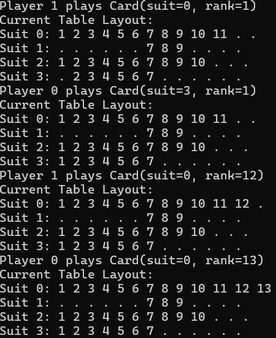

# Sevens AI – YuriaStrategy

## Team Information

- **Team Name**: Yurias
- **Student Names**: Yucheng Dai, Maria Yuryeva
- **University**: Sorbonne Université
- **Course**: Advanced C++
- **Project Period**: Spring 2025

---

## Project Overview

The goal of this project was to design and implement a smart AI agent (`YuriaStrategy`) for the card game **Sevens**, a turn-based game where players attempt to play cards in an ordered sequence by suit. 
The strategy aims to decide which card to play or when to pass in a way that maximizes its chances of winning, while taking into account:
- The current game phase
- The hand composition
- The visible table layout
- Opponent behavior patterns

This strategy was built entirely in C++ using advanced programming techniques covered throughout the course.

## Implemented Strategy

### General Design

`YuriaStrategy` is implemented as a class that inherits from the abstract interface `PlayerStrategy`. The class overrides key virtual functions:

- `initialize()` — prepares the strategy for a new game.
- `selectCardToPlay()` — decides which card to play each turn.
- `observeMove()` — reacts to opponent plays.
- `observePass()` — reacts to opponent passes.
- `getName()` — returns the name of the strategy.

### Core Concepts & Heuristics

#### 1. **Game Phase Awareness**
- The game is divided into **early**, **mid**, and **late** phases based on the number of cards played:
  - Early: <10 cards played
  - Mid: 10–29 cards
  - Late: ≥30 cards
- Strategy changes depending on the phase:
  - **Early Game**: Prioritize opening suits by playing 7s and enabling chain-building.
  - **Mid Game**: Focus on balance, maintaining flexibility while eliminating dangerous suits.
  - **Late Game**: Reduce risk and finish suits to avoid being stuck.

#### 2. **Suit Playability Tracking**
- Each suit is assigned a playability score (0 = low, 1 = medium, 2 = high) based on:
  - Number of open ends on the table
  - Whether the 7 has been played
  - How close the suit is to completion
- This value helps in prioritizing cards from flexible suits and avoiding blocked ones.

#### 3. **Card Scoring System**
Each card is scored based on:
- Whether it is a **7** (high value early)
- Whether it creates or extends a **chain**
- Whether it is an **edge card** (1 or 13)
- Whether it **opens both ends** of a suit (risk penalty)
- Suit playability
- Number of same-suit cards in hand
- Opponent pass behavior (estimated suit blockage)
- Chain length around the card

Example scoring factors:
- `+200` for a 7
- `+30 × chain length` (early game)
- `+50 × suit card count` (late game)
- `-80` if the card opens both ends (risky)

#### 4. **Opponent Behavior Tracking**
- The strategy records how often opponents pass.
- If an opponent passes **multiple times consecutively**, we assume they may be blocked in a specific suit, influencing our scoring positively if we are not exposed in that suit.

#### 5. **Strategic Logging**
- The strategy prints helpful debug logs during runtime to analyze its decisions.
- It explains why each playable card is a candidate and the breakdown of its evaluation.

---

## Sample Performance & Output
Here is a snippet of console output during a match (debug mode):
Player 0 plays Card(suit=0, rank=8)
Current Table Layout:
Suit 0: . . . . . . 7 8 . . . . .
Suit 1: . . . . . . 7 . . . . . .
Suit 2: . . . . . . 7 . . . . . .
Suit 3: . . . . . . 7 . . . . . .

---

## Sample Game Image

> Replace this with an actual screenshot or video from your implementation.

---

## How to Build and Run

### Build

To compile the skeleton code, you can execute this command in the terminal while being located in the folder with these files:

`g++ -std=c++17 -Wall -Wextra -fPIC -shared YuriaStrategy.cpp -o YuriaStrategy.dll`

Now to execute the game you can type the following line in the terminal while replacing [mode] with the mode you'd like to test (demo, internal):

`.\sevens_game.exe [model]`

If you'd like to test the competition mode,
replaces [strategy1].dll and [strategy2].dll with the respective .dll strategy files you'd like to see compete:

`.\sevens_game.exe competition [strategy1].dll [strategy2].dll`

---

## Limitations

- No learning or memory across games: the AI resets between rounds and has no long-term memory.

- No opponent modeling beyond passing: deeper inference about opponents' hands is not implemented.

- No risk estimation based on remaining deck: the bot doesn't simulate what cards are unseen.

- No consideration for turn order: the AI does not prioritize defensive moves based on position in turn cycle.

---

## Conclusion

The YuriaStrategy bot:

- Demonstrates adaptive behavior across game stages.

- Handles decision-making via a rich, weighted evaluation system.

- Performs well under varied conditions.

- Could be extended into a more intelligent AI with reinforcement learning or probabilistic simulations.

This project allowed for practical application of object-oriented C++ programming.
